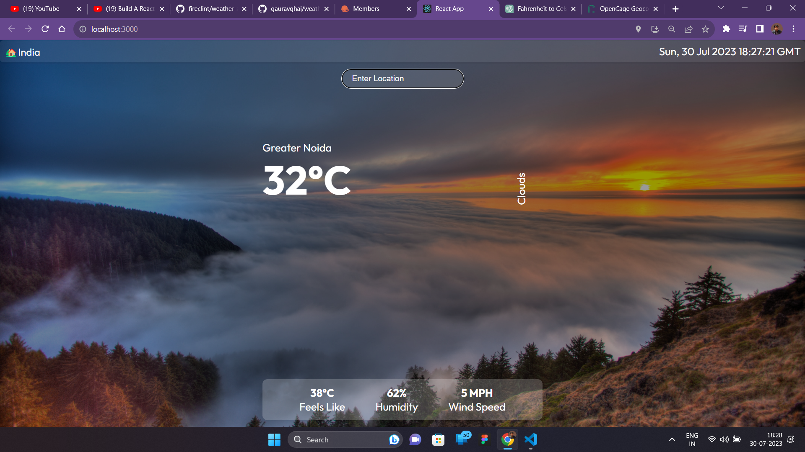

# Weather App ☁️
This is a simple React application that allows users to search for the weather information of a location. It provides weather data such as temperature, wind speed, and humidity based on the user's search input.

## Features 💡

:star: Search for weather information of any location.

:star: Display the current temperature, wind speed, and humidity.

:star: Responsive design to fit all screen sizes.

## How to Run the Application 🏃🏽💨
### 🗃️ Prerequisites
 
Before running the application, make sure you have Node.js and npm (Node Package Manager) installed on your machine.
 
Node.js: https://nodejs.org/

npm: It comes bundled with Node.js.

### ⚙️ Installing
Clone the repository to your local machine:
````
git clone https://github.com/your-username/weather-app.git
````
Navigate to the project directory:
````
cd weather-app
````
Install the required dependencies:
````
npm install
````
### 🏃🏽 Running the Application
To run the application locally, execute the following command:

````
npm start
````




This will start the development server, and you should see the application running on 
http://localhost:3000 in your web browser.

-----

### 🎰 How to Use
* Enter a location in the search bar.
* Press the "Search" button or hit the "Enter" key to fetch the weather information.
* The weather data for the entered location will be displayed, including temperature, wind speed, and humidity.

### 👨🏽‍💻 Technologies Used
* React.js: A JavaScript library for building user interfaces.
* OpenWeather API: Used to fetch weather data based on user search.

### 💗 Thank You!
Thank you for checking out this project! We hope you find it useful and enjoy using it in your projects. Happy coding!

